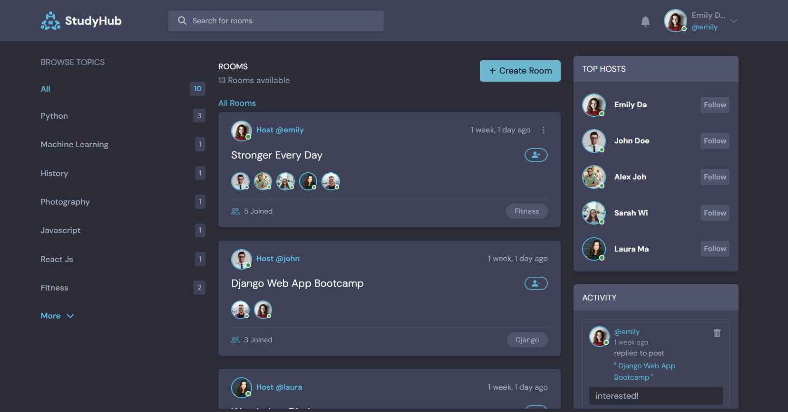
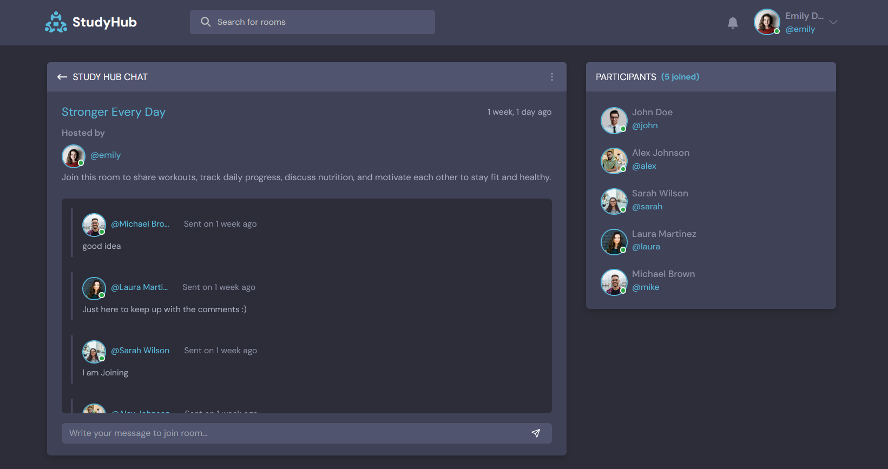

# StudyHub


   


## Overview
**StudyHub** is a full-stack educational platform built with **Python and Django**, allowing users to explore and manage learning resources seamlessly. It combines a structured backend powered by **Django and REST APIs** with a simple, responsive frontend for a smooth user experience.

This project was built to practice full-stack Django development, REST API design, and production deployment.


### Features
- ✅ User Authentication (Login/Register)
- 📚 Topic-Based Room Management
- 💬 Real-Time Room Discussions
- 🗄 PostgreSQL Integration
- 👤 Role-Based Access Control
- 🔗 Fully RESTful API Endpoints
- 🖼 Cloud-Based Media Storage (via Cloudinary)


### Tech Stack
| Feature | Technology | Version |
|--------|------------|----------|
| Backend | Python, Django, Django Rest Framework | 3.13.6, 6.0.1, 3.16.1 |
| Frontend | HTML, CSS, Bootstrap, Javascript | - |
| Database | Sqlite (development), PostgreSQL (production) | PostgreSQL 15 |
| Tools | Git, Github, Render, Cloudinary | - |


### Demo & Repository
**Live Demo** : [studyhub live](https://django-studyhub.onrender.com/)    
**Source Code** : [Github Repository](https://github.com/athikapriya/django-studyhub) 


### Preview
#### Homepage



#### Room Management



### Usage
1. Register a new account or login.
2. Create a topic-based room.
3. Start discussions with other users.
4. Explore REST API endpoints via `/api/`.

### Installation
#### Clone the repository :
```bash
git clone https://github.com/athikapriya/django-studyhub.git
cd django-studyhub
```

#### Create virtual environment :
```bash
python -m venv venv
```

#### Activate environment
##### Windows
```bash
venv\Scripts\activate
```

##### macOs/Linux
```bash
source venv/bin/activate
```

#### Install dependencies
```bash
pip install -r requirements.txt
```

#### Run migrations
```bash
python manage.py migrate
```

#### Run development server
```bash
python manage.py runserver
```


### API Endpoints
StudyHub provides RESTful API endpoints built with Django REST Framework.
| Endpoint | Method | Description |
|----------|--------|-------------|
| `/api/` | GET | Lists all available API routes |
| `/api/rooms/` | GET | Returns a list of all discussion rooms |
| `/api/rooms/:id/` | GET | Returns detailed information about a specific room |

### Contribution
Contributions are welcome! Please open an issue or submit a pull request.

### Author
**Athika Chowdhury Priya** - Python & Django Developer

Github : [athikapriya](https://github.com/athikapriya)

Portfolio : [athikapriya.netlify.app](https://athikadev.netlify.app/)

Email : [athikapriya1997@gmail.com](mailto:athikapriya1997@gmail.com)

### License
This project is open-source under the MIT License. 
  